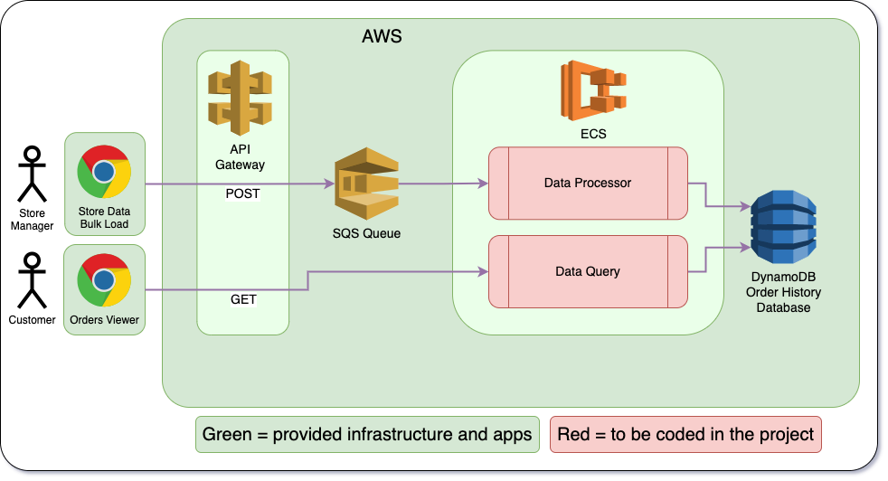

# Project Pets


We need an api where our consumers can manage and maintain a variety of pets. We need to ensure that we get good quality pets by validating each request.

These pets need to be persisted into a DynamoDb store where we can easily manage the state of each pet.

<aside class="notes">

</aside>

---

# Architecture



This is roughly the architecture we are trying to achieve.

<aside class="notes">

</aside>

---

## Requirements

--

### RESTful api

- Create the RESTful endpoints to get all, get by id, add, update and delete Pets
- Add a generic RESTful exception handler

--

### Database storage

- Use DynamoDb for your data persistence
- The PetService should interact with this db for all its operations

--

### Security

- Add a basic level of authentication by checking a request header before granting access to any request
- Add some role based access control (RBAC) to authorise what a request is permitted to do

---

### Adopt a pet

To further expand our service offering we want our clients to be able to adopt certain pets. So we need a service that gives us the ability to flag which pets are eligible for adoption.

Because of long-running services and performance considerations we decided to process these requests asynchronously by using a queue.

Your task is to create a new endpoint that adds these requests to a queue, and have a separate task that consumes these requests and updates the record accordingly.

---

### Adopt a pet (cont)

- Create a new RestController that takes, as input, the `petId` and `adopt` fields
- Validate this request
- Add the request to an SQS queue (use Localstack)
- Create a class that consumes messages from this SQS queue (again use LocalStack)
- Fetch the pet from the database and update the `adopt` value

---

## Additional bonus points

- Add validation around your RESTful requests
- Unit test with 90% code coverage
- Integration tests that calls your endpoints and uses Localstack for any AWS resources-
- Look at inheritance to improve the polymorphic relationships between the types of pets
- Instead of using a String type for the pets, look to replace it with an enum
- Implement CircuitBreaker on one of your PetService methods
- Implement Retries on one of your PetService methods
- Practice TDD while implementing these requirements

<aside class="notes">
</aside>

# Notes

Created local dynamo db table with 
```bash
aws dynamodb create-table --endpoint-url http://localhost:8000 \
    --table-name Pet \
    --attribute-definitions AttributeName=id,AttributeType=S \
    --key-schema AttributeName=id,KeyType=HASH \
    --provisioned-throughput ReadCapacityUnits=1,WriteCapacityUnits=1
```
